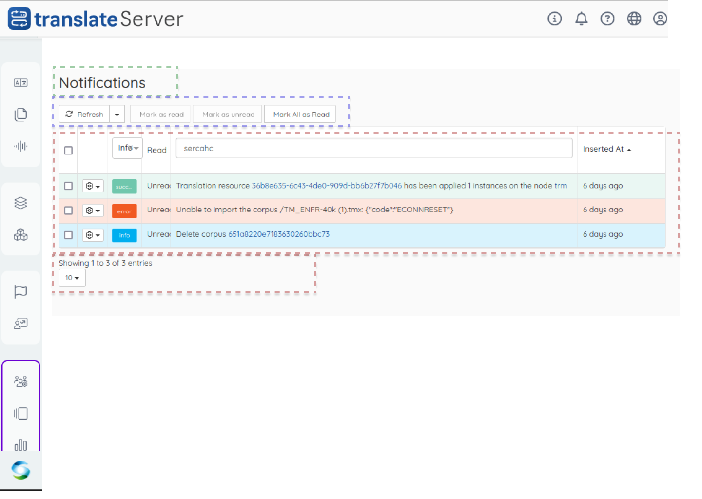
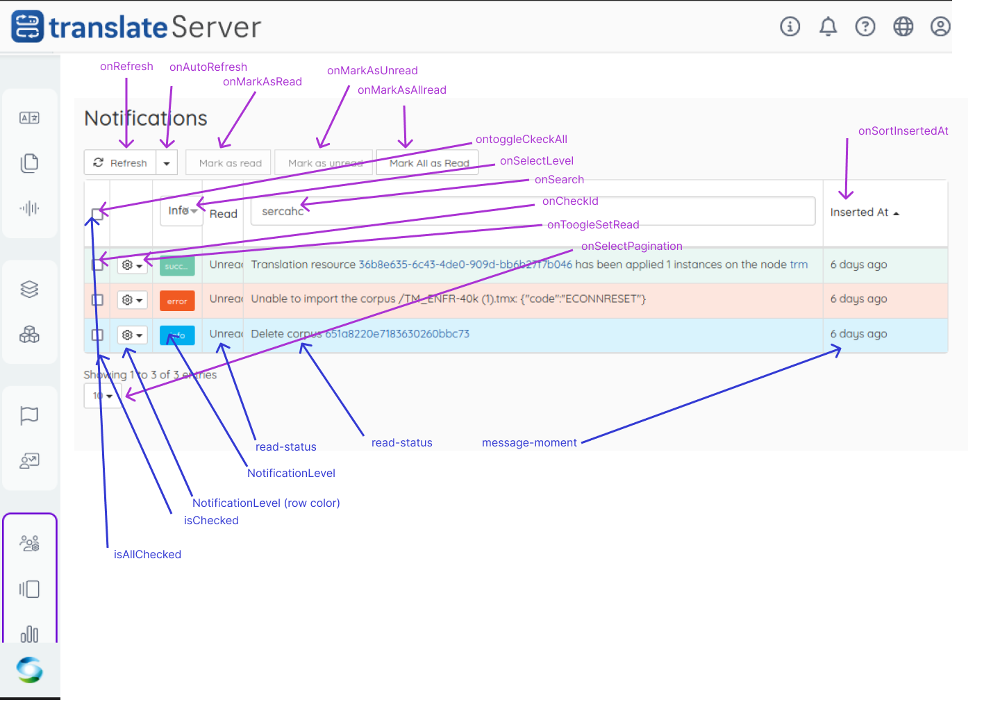

# nanostore
 
1. [link to github doc](https://github.com/nanostores/nanostores)

1. install nanostore 

    ```sh
    npm i nanostores @nanostores/react
    ```


# Approach

1. [Component zoning](#component-zoning)
1. [page wire-frame](https://www.figma.com/file/poB5H5nQGlV1QiSBnaUGAC/Notifications?type=design&t=u59QEtwXtrZjR6Wm-6)  with react-schema  (state-> action -> effect->UI) 
1. coding for each part 
1. insert styles and theme


# Nanostore in a nuttshell
store : containts informations

1. Event triggers action
1. Action changes the information in store 
1. Store pushes changes to UI

# Component zoning
 for notifications page :  [see figma](https://www.figma.com/file/poB5H5nQGlV1QiSBnaUGAC/Notifications?type=design&node-id=5-105&mode=design&t=XeYXydSFCCq5DLJc-0)

 


 # page wire-frame
 ## schema

  [schema here]()https://www.figma.com/file/poB5H5nQGlV1QiSBnaUGAC/Notifications?type=design&node-id=0-1&mode=design&t=XeYXydSFCCq5DLJc-0

  


## coding 

1. actions
    - onRefresh  => setRefresh
    - onAutoRefresh => setRefresh
    - onMarkAsRead => setRead
    - OnMarkAsUnread => setUnread
    - OnToogleCHeckAll => setAllRead
    - OnSearch
    - OnCheckId
    - OnToogleSetRead  -> should be =onSetRead
    - onSelectpagination
    - onSortInsertedAt
1. states

    - isAllChecked 
    - isChecked
    - notificationLevel
    - notificationLevel (rowColor)
    - readStatus
    - message
    - messageMoment


