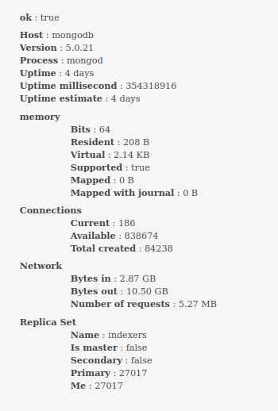
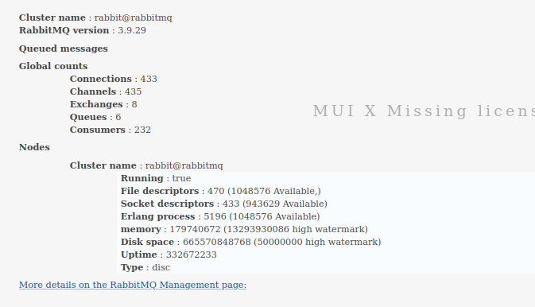
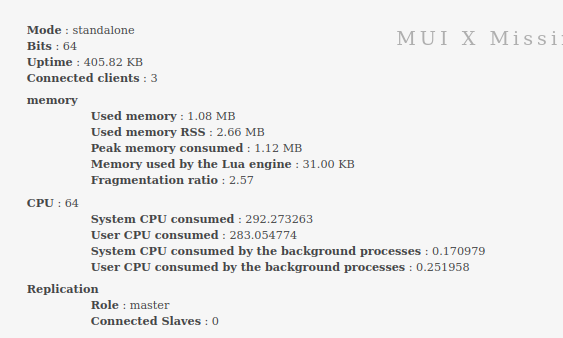
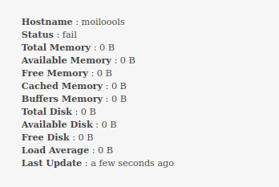

# page service

# requierement

1. display service registerd

| expand | check column | status        | name         | Hostname                   |
| ------ | ------------ | ------------- | ------------ | -------------------------- |
| >      | [ ]          | fail, running | service name | http://corpus-mananer:8809 |


# data come from 
https://localhost:3449/monitoring/list'
an example of data retrieve : [example-json](./data/AdministrationServerManagementServices.json)


1. data needed is differente for expand information according to each service


# expand information
 &
## specfique  expand 
 MONGO_DB:
 example : 
 RABIT_MQ

 REDIS &REDIS_NODE 


 COMPUTING_NODE 
## default expand 

 TRS_POLLER:
    TRS_CONSOLE:
    SES_CONSOLE:
    ELASTIC_SEARCH:
    TM_INDEXER:
    GATEWAY:
    LOOKUP_SERVER:
    DCT_INDEXER:
    GDICT:
    DISPATCHER:
    ROUTING_SERVER:
    CORPUS_MANAGER:
    BROKER:
    ACTIVITY_SERVER:


## request

request for delete service

https://localhost:3450/computingNode/deregister

request for list service
/api/monitoring/list'
'/monitoring/list'

## expand

expand/collape => règle d'affichage

enterprise-server/react/advancedConfiguration/components/services/StatusBox.jsx

expand/collape mongoDB et Redis
/home/destrieux/dev/enterprise-server/react/advancedConfiguration/components/services/DBBox.jsx
/home/destrieux/dev/enterprise-server/react/advancedConfiguration/components/services/CacheBox.jsx

rabitMQ
enterprise-server/react/advancedConfiguration/components/services/QueueBox.jsx

switch => expand
/home/destrieux/dev/enterprise-server/react/advancedConfiguration/components/services/ServicesTable.jsx

get list service
https://localhost:3450/monitoring/list

## modal

avec deregistrer

Dispatcher
Routing Server

ici peut-etre /home/destrieux/dev/enterprise-server/redux/services/operations.js

deregister service Computing Node (TRM) (localhost)

https://localhost:3450/queue/deregister
hostname "broker"

requette json hostname "localhost"

## register

https://localhost:3450/computingNode/register
hostname "localhost"

    ```js
      https://localhost:3450/${serviceCode}/register

    ```
    {"hostname":"lulu","secure":false}
    {"hostname":"host routing server","secure":false}

ServiceName.BROKER => https://localhost:3450/queue/register
ServiceName.COMPUTING_NODE => ttps://localhost:3450/computingNode/register
ServiceName.DISPATCHER = https://localhost:3450/dispatcher/register
ServiceName.ROUTING_SERVER,https://localhost:3450/route/register
ServiceName.REDIS_NODE => https://localhost:3450/cache/register

mode secure / not sécure tous sauf broker

check if exist do not allow

## deregster

#{"hostname":"lulu"}

ServiceName.BROKER, ==> https://localhost:3450/queue/deregister
ServiceName.COMPUTING_NODE, https://localhost:3450/computingNode/deregister
ServiceName.DISPATCHER,https://localhost:3450/dispatcher/deregister
ServiceName.ROUTING_SERVER,https://localhost:3450/route/deregister
ServiceName.REDIS_NODE https://localhost:3450/cache/deregister

exemple test :
https://localhost:3450/cache/deregister E
T => https://localhost:3450/cache/deregister

E => {"hostname":"hostredis"}
T => {"hostname":"hostredis"}


# suspicious informations

data given shoud be in Byte
    totalMemory: jsonDataComputingNode.totalMemory,
    availableMemory: jsonDataComputingNode.availableMemory,

but regaarding to the result it could be in KB ??